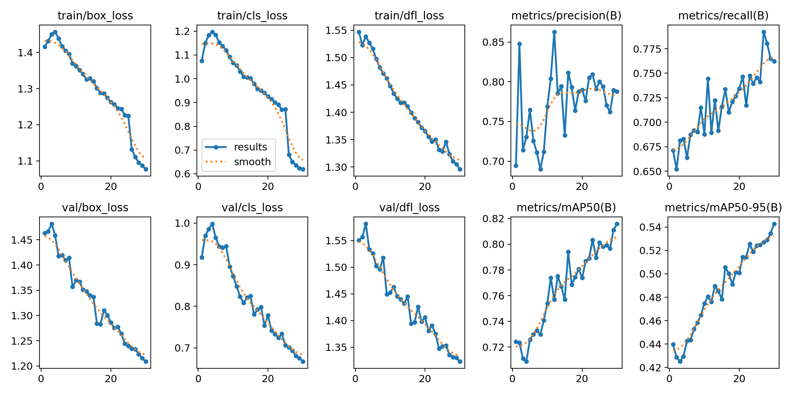
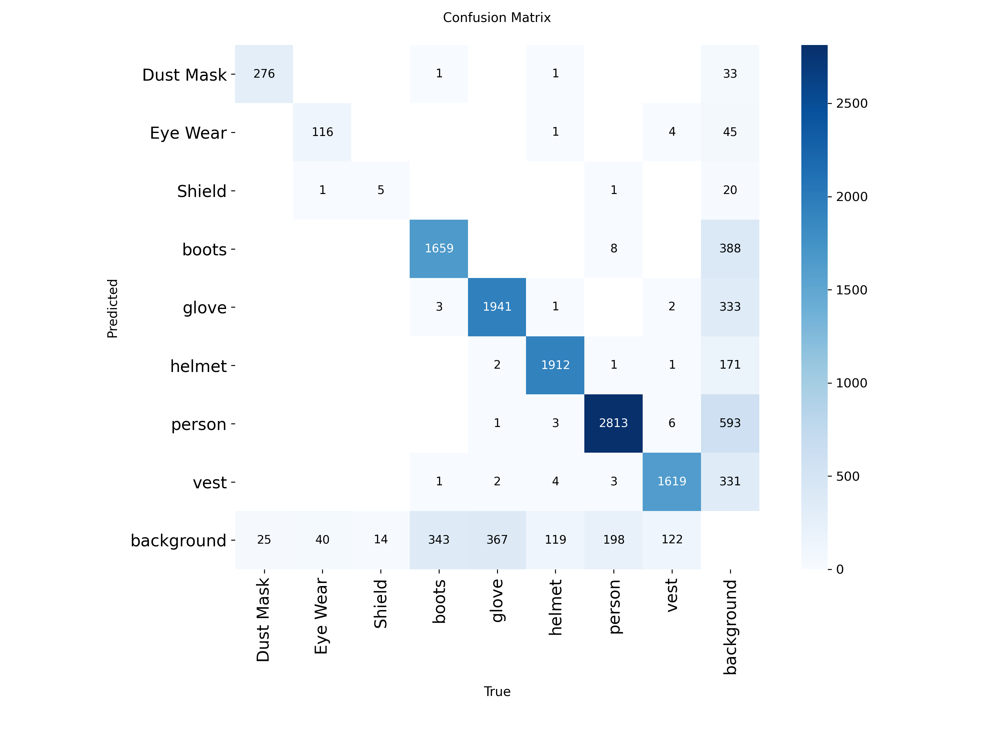
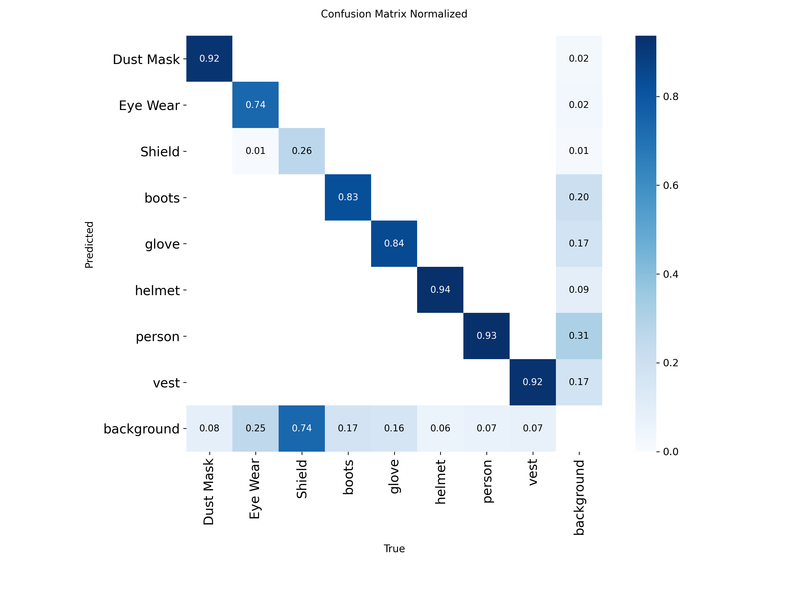
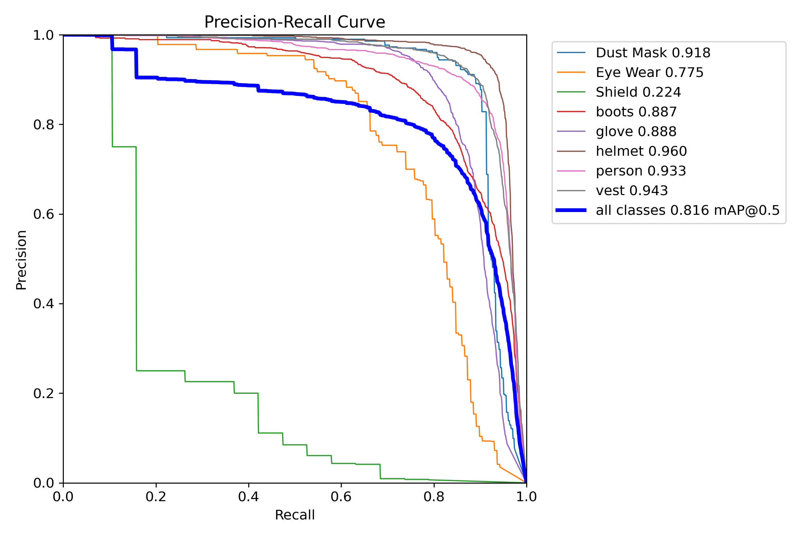
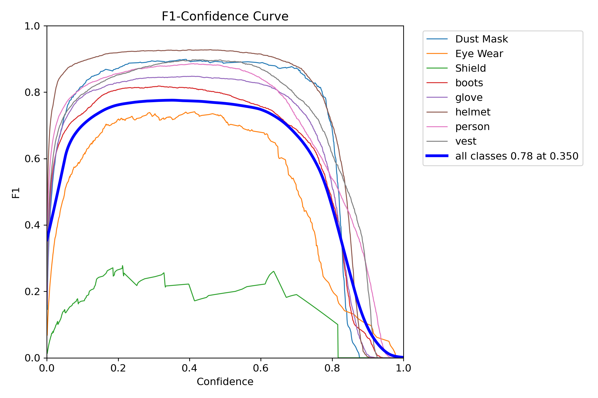
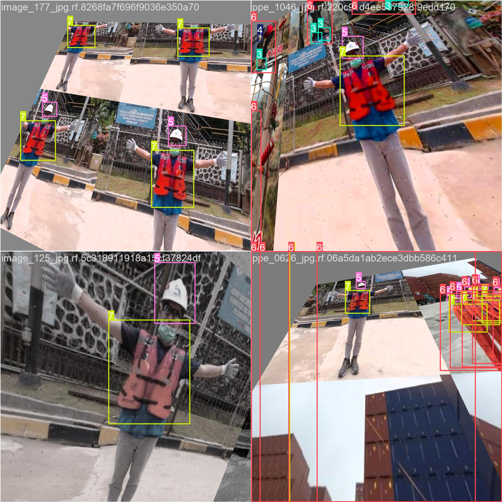
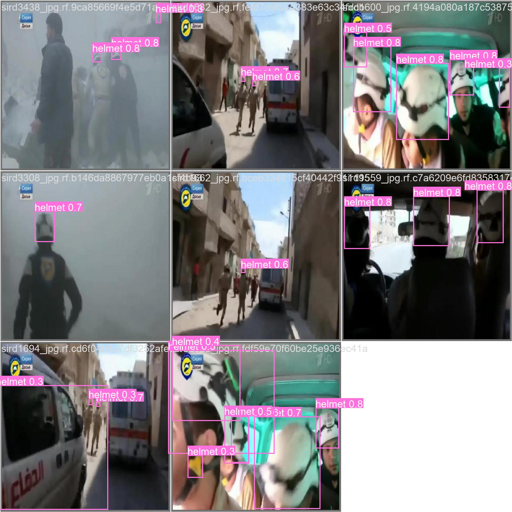

## PPE Detection CV Model — Training Methodology and Results

This module documents how the PPE compliance detector was trained and why it works for analyzing chunks in the `rtsp-stream-worker`.

### Objective
Detect missing PPE on workers (e.g., missing hardhat, vest, gloves) within factory and construction environments. Outputs are overlaid during preprocessing so the worker can chunk, upload to NVIDIA VSS, and index richer, annotated video segments.

### Dataset & Labeling
- Sources: curated industrial clips and internal recording samples
- Labels: PPE presence classes and context (e.g., person, helmet, vest)
- Splits: train/val following scene diversity to minimize leakage

### Model & Training Setup
- Base: Ultralytics YOLO (weights fine‑tuned)
- Resolution: imgsz=1280 for better small object fidelity
- Augmentations: mosaic, HSV, flips; tuned to preserve PPE color cues
- Hyperparameters: confidence/iou thresholds tuned per validation PR curves
- Hardware: single GPU fine‑tune with mixed precision

### Why It Works
- High‑resolution fine‑tuning improves helmet/vest detection at distance
- Domain examples across lighting/motion conditions reduce false negatives
- Post‑processing thresholds chosen via PR/F1 maxima on validation set

### Results
Representative artifacts from `ppe_training_runs/yolo11m_finetune_imgsz1280_run12/`:

Sample batches (training/validation):

Weights are stored in `ppe_training_runs/.../weights/` and the best export deployed as `rtsp-stream-worker/cv_model_best.pt` for inference.

### Inference Integration
`rtsp-stream-worker` loads the exported YOLO weights, draws detections, and writes an annotated video. The annotated video is then chunked and uploaded to NVIDIA VSS so downstream search and summarization can leverage richer visual cues.

